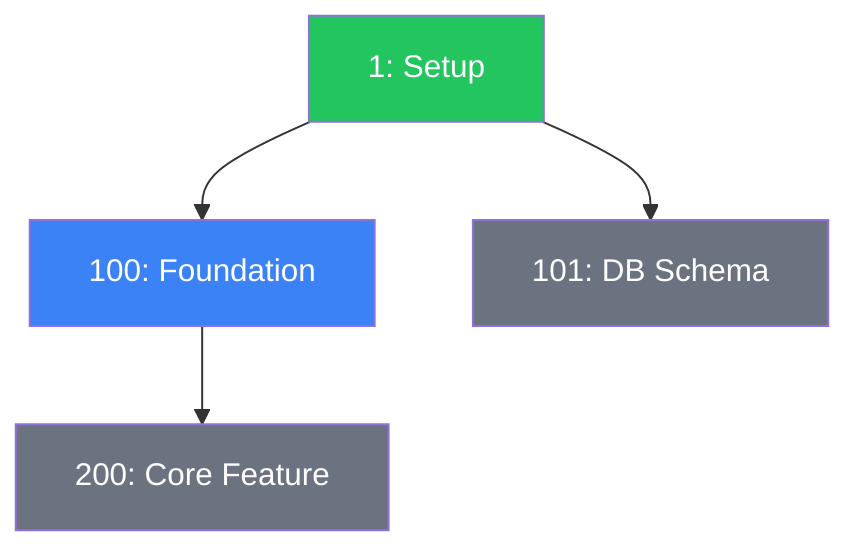

## HELP CONTRACT (T442 — cross-platform, non-substitutable)

If the invoking command's arguments are EXACTLY `-h`, `--help`, or `help` (one
token, nothing else): do NOT run any operation of this skill. Respond ONLY with a
compact usage card — the command's name, its one-line purpose, each documented
argument/option on its own line (or "none"), and the path to its command file —
then STOP. Read-only: no `.gald3r/` writes, no state changes, no task/bug
creation. This block lives in the SKILL (not a rule) because skills are the
execution layer on every supported platform; rules are optional context on most.

# gald3r-dependency-graph

## When to Use
- After creating a task with `dependencies: [...]`
- After updating a task's `dependencies` field
- During `@g-cleanup` (Step 8)
- When user asks for "dependency graph", "task dependencies", "what blocks what"

## Generation Steps (T470 — native DB-backed path)

The state DB (`.gald3r/gald3r.db`) is the source of truth for task
dependencies (g-rl-40 rule 2), and
`gald3r_core.project.gald3r_integration.queries.get_dependency_graph`
(T464) already returns the full `nodes` + `edges` graph — including
dangling-reference flagging — as one deterministic read. Do **not** hand-read
`.gald3r/tasks/task*.md` files to rebuild this graph; run the native CLI
verb instead:

```
gald3r dependency-graph
```

This renders the complete `DEPENDENCY_GRAPH.md`-shaped report (Critical
Path, Mermaid graph, Top Blockers, Currently Blocked Tasks, Orphan Tasks) to
stdout, computed entirely from `get_dependency_graph`'s query result — no
extra file reads. To write it directly to `.gald3r/DEPENDENCY_GRAPH.md`:

```
gald3r dependency-graph --output .gald3r/DEPENDENCY_GRAPH.md
```

Useful flags:
- `--mermaid-only` — print just the Mermaid `graph TD` block (no report sections)
- `--json` — print the raw `{"nodes": [...], "edges": [...]}` payload
- `--db PATH` / `--root PATH` — target a specific project when not run from its checkout
- `--project-name NAME` — populate the report's `**Project**:` header line

If `.gald3r/gald3r.db` does not exist yet (or is stale), run
`gald3r db backfill` first — the verb reports this explicitly and exits
non-zero rather than silently falling back to a file scan.

### What the verb computes (all derived from `nodes`/`edges`, zero extra reads)

1. **Dependency graph** — one Mermaid node per task (`display_id`, `title`,
   status → `classDef`); one edge per `(task, depends_on)` pair. **Dangling**
   edges (a `dependencies:` entry that resolves to no known task) are KEPT,
   never dropped — rendered as a dotted `-.->|dangling|` arrow into a
   synthetic `(missing)` node with its own style class, so a stale/typo'd
   reference is visible at a glance instead of silently vanishing.
2. **Critical path** — longest chain of resolved (non-dangling) dependency
   edges from any root to any leaf (memoized DFS, cycle-safe).
3. **Top blockers** — tasks ranked by how many other tasks transitively
   depend on them (top 3).
4. **Currently blocked tasks** — tasks with at least one resolved dependency
   on a task whose status is not yet `completed`.
5. **Orphan tasks** — tasks with no resolved dependency edges at all (no
   dependencies, and nothing depends on them).

### Example Mermaid block



### Fallback (no CLI access to the target project)

If the native verb genuinely cannot be run against the target project (e.g.
a read-only remote review context with no shell access to that project's
`.gald3r.db`), fall back to a manual read of `.gald3r/tasks/task*.md`
frontmatter (`id`/`title`/`status`/`subsystem`/`priority`/`dependencies`)
and reproduce the same five sections by hand. This is a degraded path, not
the normal one — prefer the CLI verb whenever it is reachable.

## Integration Points

This skill is triggered by:
1. **g-skl-tasks** — after creating a task with non-empty `dependencies`
2. **g-skl-tasks** — after updating a task's `dependencies` field
3. **g-skl-medic** — Phase 6 routine maintenance
4. **`@g-dependency-graph`** command — direct invocation, now backed by
   `gald3r dependency-graph` (T470) instead of a hand-rolled task-file scan

The graph is always regenerated from scratch (not incrementally) to avoid drift.
